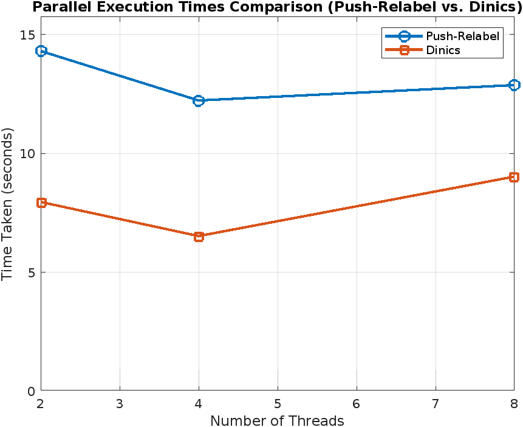
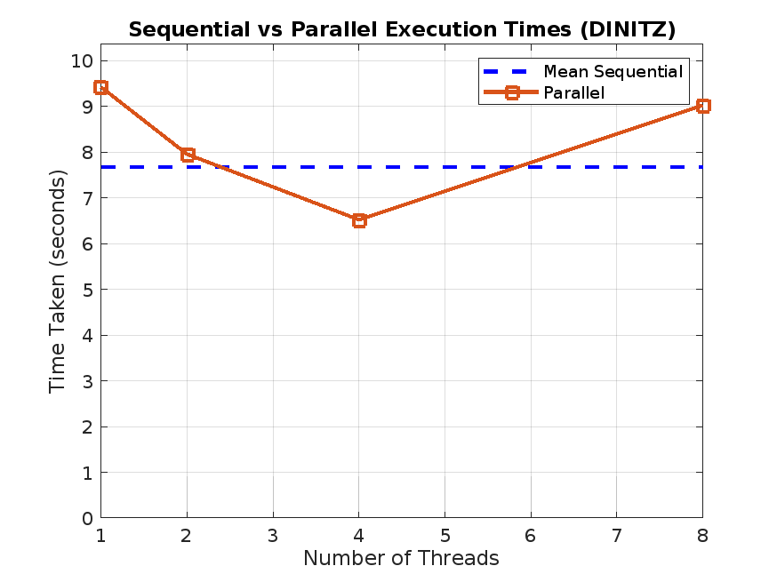
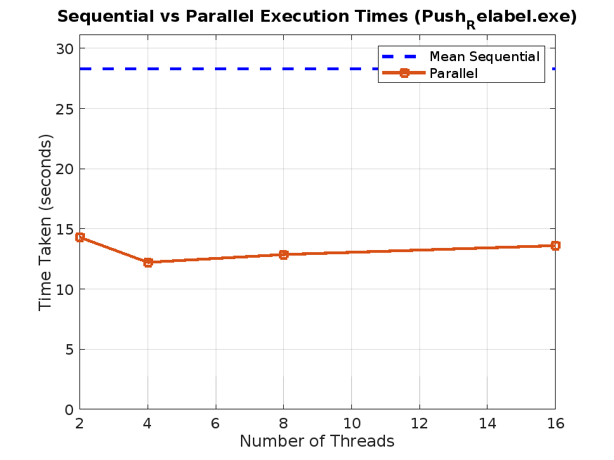

# Documentation SDP Project
## Project Q3 Flow Network

### 1. Introduction
The project was about finding the maximum flow that can be sent from a source vertex to a sink vertex in a flow network, represented as a directed graph with capacities on its edges. The project implements Dinic's algorithm to compute the maximum flow in a flow network.

### 2. Design Choices

#### 2.1. Graph Generation
#### 2.1.1 Input Parameters  
  Describe the parameters used to generate the graph (e.g., number of vertices, edge probability, and maximum edge capacity).

- **Efficiency in Space Usage**:  
  - **Sparse Graphs**: For graphs where most possible edges do not exist (low edge probability), this approach is particularly efficient. By not explicitly storing absent edges (which would have a capacity of zero), you save considerable memory.
  - **Adjacency List-Like Behavior**: The generated output file resembles an adjacency list in terms of storage. The first line in the file corresponds to the total number of vertices in the graph. Following lines store vertices connected to adjacent vertices with their capacity. The last line provides information about the source and sink nodes.

  Example:  total no of vertices
            vetices1 vertice2 capacity
            source sink

- **Dynamic Edge Creation**:  
The decision to create an edge between any two vertices is made dynamically based on the given `edgeProbability`. Depending on the edge probability, we define the denseness of the graph. Graphs with high `edgeProbability` are highly connected and are considered dense graphs. By assigning a random capacity to each edge at the time of its creation, we avoid unnecessary storage for edges with zero capacity.

- **Scalability**:  
Larger graphs with thousands of vertices scale well but exhibit linear growth in memory consumption as the number of vertices and the edge density grows. Graphs with lower density will consume less memory due to sparser connections. This method is designed to scale efficiently with large graphs by focusing on space efficiency and avoiding the pre-allocation of large structures (like full adjacency matrices), allowing it to handle graphs with large numbers of vertices while keeping memory usage low.

- **Potential Trade-Offs**:  
The output file is compact and stores only relevant information. While it may be less interpretable than an adjacency matrix, this method optimizes memory consumption. However, this approach involves some computation since each edge is generated dynamically and its capacity is decided on the fly.

#### 2.1.2. Implementation Details
- **Randomization**:  
The use of `rand()` seeded with the current time (`srand(time(nullptr))`) ensures that each graph generated is unique, providing a wide variety of test cases for flow network algorithms.

- **File Output**:  
The generated graph is saved in a simple text file, where each line represents an edge with its source, destination, and capacity. The source and sink nodes are explicitly defined at the end of the file.

#### 2.1.3. Advantages
- **Reduced Memory Footprint**:  
By only storing actual edges, the algorithm minimizes the memory required to represent the graph.

- **Flexibility**:  
The parameters for vertex count, edge probability, and maximum capacity allow for flexible generation of a wide range of graph structures, from very sparse to relatively dense networks.

#### 2.2. Graph Reading
#### 2.2.1. File Structure
The file is formatted in a way we obtain the number of vertices *n* from the first line, the edges from the following n lines, formatted as *starting_node destination_node capacity*, and the *source* and *sink* nodes from the last line:

    n
    node1 node2 capacity
    [...]
    source sink

- **Sequential Reading**: 
The file is read in a sequential manner, such that, before populating the graph, the number of nodes n is taken from the first line of the file. The graph is created accordingly to this measure and a `for` loop is initialized starting from 0 to n, reading the edges of the graph and storing the values into the adjacency matrix. After the for loop is terminated, the source and the sink are read.

#### 2.2.2. Advantages of the Sequential Reading
- **Simplicity and Predictability**:  
   Sequential reading ensures that the data is read in the same order as it appears in the file. This approach minimizes complexity compared to parallel file reading, where managing file pointers and synchronizing multiple threads can introduce challenges.
- **I/O Bound Operations**:    
   File reading is typically an I/O-bound operation, meaning it is limited by the speed of the file system rather than the CPU. As such, parallelizing the file reading process might not yield significant performance gains, particularly for small to medium-sized files.
-  **Memory Allocation and Data Structure Initialization**:
   The adjacency matrices (graph and graph1) are initialized after reading the number of vertices. This sequential order of operations ensures the matrices are properly allocated before edge data is read and inserted, aligning with the sequential file reading process.
- **Thread Safety**:   
   Sequential file reading avoids the complications of managing thread safety in parallel operations, such as race conditions that could arise if multiple threads attempt to read or write simultaneously. This approach ensures data consistency and correctness.

#### 2.3. Data Structures  
To represent the graph it was used the adjacency matrix, rather than the adjacency list. The reason why of this choice is related to the fact that we wanted to achieve more performances with respect of bigger graphs. The adjacency matrix, in fact, allows a direct access to the cells, simplifying some processes that are performed during the execution of the algorithms, especially when repeated many times.  
A version using adjacency list was written but not put inside the project, since not used for the final tests.

#### 2.4. Parallelization Design
For all the versions of the maximum flow problem, to account parallelization, OpenMP API is used.
Moreover, each version runs a sequential version, measuring the execution time, and then a parallelized one, measuring the elapsed time even in this case, in order to compare the results. 
Measures have been taken using `omp_get_wtime()` in omp.h library.

#### 2.4.1. Parallelization in Dinic's Algorithm
- **Parallel Breadth-First Search (BFS) - bfsParallel Function**:  
    - **Purpose**:  
    BFS is used to construct the level graph, which is a critical step in Dinic's algorithm.
    - **Parallelization Strategy**:  
The loop iterating over vertices *(v)* adjacent to the current node *(u)* is parallelized using OpenMP.
The `#pragma omp parallel for` directive distributes the work of checking and updating levels across multiple threads.
    - **Critical Section**:   
  A critical section is used to ensure that only one thread updates the level of a vertex or pushes it into the queue at a time. This prevents race conditions where multiple threads might attempt to modify the same data simultaneously.
    - **Condition**:   
  If the sink node *(t)* is found during the BFS, a flag *(found)* is set to true, and the BFS can terminate early.

- **Parallel Execution of Dinic's Algorithm - dinicParallel Function**:
    - **Purpose**: This function orchestrates the overall execution of the parallel BFS and DFS within the Dinic's algorithm framework.
    - **Flow**: The algorithm repeatedly performs parallel BFS to construct the level graph and then uses DFS to find blocking flows until no more augmenting paths exist.
    - **Comparison**: A parallel version `dinicParallel` and a sequential version `dinic` are both implemented to allow comparison of performance.

#### 2.4.2. Parallelization in Edmond-Karp Algorithm
- **Parallel Breadth-First Search (BFS) - bfsParallel Function**:
    - **Purpose**:   
   BFS is used to find the shortest augmenting path from the source *(s)* to the sink *(t)* in the residual graph. This step is essential for determining the path along which flow can be augmented.
    - **Parallelization Strategy**:   
  The parallelization occurs within the loop that iterates over all vertices *(v)* adjacent to the current node *(u)*. This loop checks if a vertex can be visited (i.e., if it has not been visited before and the residual capacity from u to v is positive).
    - **Nested Parallelism**: The outer loop running the BFS is enclosed in an `#pragma omp single` block to ensure that only one thread handles the queue operations at a time. Inside, a parallel for-loop `#pragma omp parallel for` is used to explore the adjacent vertices in parallel.
    - **Critical Section**: A critical section `#pragma omp critical` ensures that the queue is updated safely when multiple threads find adjacent vertices that can be visited. The visited array is also updated within the critical section to prevent race conditions.
    - **Atomic Operation**: An atomic operation `#pragma omp atomic write` is used to update a shared flag *(found_path)* when the sink node is discovered. This flag allows the BFS to terminate early if the path to the sink is found by any thread.
    - **Early Termination**: The BFS loop can break early if a path to the sink is found, reducing unnecessary computations.

- **Parallel Execution of Edmonds-Karp Algorithm - edmondsKarpParallel Function**:
    - **Purpose**:   
  This function orchestrates the overall execution of the Edmonds-Karp algorithm using the parallel BFS to find augmenting paths. It computes the maximum flow by repeatedly finding and augmenting the flow along the shortest paths from the source to the sink.
    - **Flow**:  
  The algorithm repeatedly performs a parallel BFS to find the shortest augmenting path in the residual graph.
  Once a path is found, the algorithm determines the minimum capacity along this path and augments the flow by this amount.
  The residual capacities of the edges and reverse edges along the path are updated accordingly.
    - **Comparison**:  
  Both the sequential `edmondsKarpSequential` and parallel `edmondsKarpParallel` versions of the Edmonds-Karp algorithm are implemented to allow performance comparisons between them.

#### 2.4.3. Parallelization in Push-Relabel Algorithm
- **Initialization Phase**:  
The initialization phase for both sequential and parallel versions starts by setting the height of the source node to n (the number of vertices) and pushing as much flow as possible from the source to its neighbors.
This phase is inherently sequential as it involves setting up the initial state before any parallel processing begins.

- **Parallel eExecution of Push-Relabel - getMaxFlowParallel Function**:
  - **Goal**: The main loop in the parallel version seeks to process "active" nodes—those with excess flow—to either push flow to their neighbors or relabel themselves to find new paths to push flow.
  - **Parallelization Strategy**:
    - **Active Nodes Identification**:   
    Each thread identifies nodes with excess flow in parallel. A boolean flag *(active)* is used to track whether any node remains active across iterations. This flag is updated using OpenMP atomic operations to ensure thread safety.
    - **Push Operation**:  
    For each active node, the algorithm checks its neighbors and attempts to push flow to any neighbor that satisfies the push condition (i.e., the neighbor has a lower height and there is available capacity).
    The *push* operation is performed within a critical section `#pragma omp critical` to ensure that updates to the shared data structures (like *flow* and *excess*) are thread-safe.
    - **Relabel Operation**:
    If a node cannot push flow to any neighbor, it is relabeled (its height is increased). This operation is also enclosed within a critical section to prevent race conditions.
    - **Local and Global Activity Tracking**:
    Each thread maintains a local status *(local_active)* to track if it found any active node during its iteration. This is combined with a global atomic update to the active flag, ensuring that the main loop continues until no nodes are left to process.
  - **Handling Concurrency**:
    - **Critical Sections**:    
    The *push* and *relabel* operations modify shared resources (*flow*, *excess*, *height*) and therefore are enclosed in critical sections. This prevents race conditions but could lead to contention if many threads attempt to modify the same resources simultaneously.
    - **Atomic Operations**:    
    The active flag, which determines if the main loop should continue, is updated atomically to prevent inconsistencies when multiple threads update it concurrently.
    - **Thread Workload Distribution**:  
    OpenMP's `#pragma omp for` directive is used to distribute the workload (iterating over nodes) among the threads. The nowait clause is used to avoid implicit barriers, allowing threads to continue working without waiting for others.

---

### 3. Experimental Evaluation

#### 3.1 Setup
- **Hardware**:  
- Local System: The experiments were conducted on a system with [insert details: e.g., 4-core CPU, 8GB RAM].
- Google Colab: An online platform providing access to more powerful hardware, including up to 12GB of RAM.

- **Software Environment**:  
The code was compiled using GCC with OpenMP enabled, running on Windows, Linux, and Mac.

#### 3.2 Test Cases
- **Graph Sizes**:  
The algorithm was tested on graphs with varying sizes, from small (100 vertices) to large (50,000 vertices).

- **Thread Counts**:  
The parallel version was tested with different numbers of threads (1, 2, 3, 4, 6, 8 threads) to evaluate scalability.

- **Computation Platform**:
Due to RAM limitations on the local system, larger graphs and more intensive tests were performed on Google Colab. This platform provided the necessary computational resources to handle larger datasets and more complex calculations, ensuring that the tests could be conducted without running into memory-related issues.

#### 3.3 Results
- **Performance Comparison**:
- The sequential version was used as the baseline.
- The parallel version's execution time was compared to the sequential version.
- It was observed that with increasing graph size, the parallel version shows some performance gains, though the simple parallelization approach used might not fully exploit the available CPU cores.

- **Memory Usage**:  
No significant difference in memory usage was observed between the sequential and parallel versions since both used the same graph representation and algorithmic approach.

- **Platform Impact**:
The ability to use Google Colab's additional resources was crucial for handling large graphs that could not be processed on the local system. The enhanced memory and processing power on Colab facilitated testing and comparison of the algorithm's performance on more demanding scenarios.

#### 3.4 Analysis
To analyze and compare the performance of three maximum flow algorithms—Edmond-Karp, Dinitz, and Push-Relabel—we evaluated their efficiency using graphs with varying dimensions and edge probabilities. This analysis aimed to assess each algorithm’s performance and scalability under different conditions.
- **Edmond-Karp**
We tested the Edmond-Karp Algorithm with graphs of various sizes, but its performance was notably poor. With a graph of 10,000 nodes and an edge probability of 5%, Edmond-Karp took around 875 seconds to complete, which was significantly longer than the times achieved by Dinitz and Push-Relabel, both of which completed the task in under 10 seconds. Due to the algorithm's excessive computation time and its inability to benefit from parallelization effectively, we decided to halt further testing with larger graphs. Edmond-Karp did not show promising results even with parallel execution, reinforcing its inefficiency for large-scale problems.
![Edmond Karp is much slower for large graphs [10k nodes]](pictures/emond_karp_long.png)
- **Dinitz and Push-Relabel**
The Dinitz algorithm consistently demonstrated faster execution times compared to the Push-Relabel algorithm. 

However, its parallelization performance was suboptimal. Despite running with up to 8 threads, the improvements in parallel execution time were marginal, indicating that Dinitz does not scale well with additional threads for large, dense graphs.

On the other hand, the Push-Relabel algorithm, while slower in sequential execution, exhibited notable advantages in parallel execution. Even though the parallel execution times increased with the number of threads—likely due to overhead and diminishing returns—the Push-Relabel algorithm still provided better performance compared to its sequential counterpart. For dense graphs with high edge probabilities, Push-Relabel showed effective parallelization benefits, making it a strong candidate for scenarios where parallel processing is crucial despite its inherently slower performance. 

We also encountered significant challenges when testing larger graph sizes. Specifically, we halted testing at a graph size of 25,000 nodes due to increasing execution times and frequent system crashes caused by insufficient RAM. 

- **Detail Results from testing**
#### Graph 1: 100 Vertices, 30% Edge Probability, Maximum Edge Capacity 50
| Algorithm      | Maximum Flow | Sequential Time Taken (s) | No. of Threads | Parallel Time Taken (s) |
|----------------|--------------|---------------------------|----------------|-------------------------|
| Dinitz         | 590          | 0                         | 2              | 0.000999928             |
| Edmond-Karp    | 590          | 0.0180001                 | 2              | 0.00999999              |
| Push-Relabel   | 590          | 0.05                      | 2              | 0.111                   |

#### Graph 2: 100 Vertices, 100% Edge Probability, Maximum Edge Capacity 50
| Algorithm      | Maximum Flow | Sequential Time Taken (s) | No. of Threads | Parallel Time Taken (s) |
|----------------|--------------|---------------------------|----------------|-------------------------|
| Dinitz         | 2551         | 0.00100017                | 2              | 0.00399995              |
| Edmond-Karp    | 2551         | 0.0289998                 | 2              | 0.029                   |
| Push-Relabel   | 2551         | 0                         | 2              | 0.00399995              |

#### Graph 3: 1000 Vertices, 1% Edge Probability, Maximum Edge Capacity 50
| Algorithm      | Maximum Flow | Sequential Time Taken (s) | No. of Threads | Parallel Time Taken (s) |
|----------------|--------------|---------------------------|----------------|-------------------------|
| Dinitz         | 225          | 0.04                      | 2              | 0.042                   |
| Edmond-Karp    | 225          | 0.511                     | 2              | 0.52                    |
| Push-Relabel   | 225          | 0.114                     | 2              | 0.097                   |

#### Graph 4: 5000 Vertices, 10% Edge Probability, Maximum Edge Capacity 20
| Algorithm      | Maximum Flow | Sequential Time Taken (s) | No. of Threads | Parallel Time Taken (s) |
|----------------|--------------|---------------------------|----------------|-------------------------|
| Dinitz         | 5028         | 0.67                      | 2              | 0.692                   |
| Edmond-Karp    | 5028         | 54.01                     | 2              | 53.877                  |
| Push-Relabel   | 5028         | 1.92                      | 2              | 1.611                   |

#### Graph 5: 5000 Vertices, 50% Edge Probability, Maximum Edge Capacity 20
| Algorithm      | Maximum Flow | Sequential Time Taken (s) | No. of Threads | Parallel Time Taken (s) |
|----------------|--------------|---------------------------|----------------|-------------------------|
| Dinitz         | 26088        | 1.34751                   | 4              | 1.2639                  |
| Edmond-Karp    | 26088        | 1073.12                   | 2              | 1072.03                 |
| Push-Relabel   | 26088        | -                         | 4              | -                       |

#### Graph 6: 10000 Vertices, 1% Edge Probability, Maximum Edge Capacity 50
| Algorithm      | Maximum Flow | Sequential Time Taken (s) | No. of Threads | Parallel Time Taken (s) |
|----------------|--------------|---------------------------|----------------|-------------------------|
| Dinitz         | 2611         | 5.740                     | 2              | 3.708                   |
| Edmond-Karp    | 2611         | 570.535                   | 2              | 574.839                 |
| Push-Relabel   | 2611         | 8.989                     | 2              | 0.025                   |

#### Graph 7: 10000 Vertices, 5% Edge Probability, Maximum Edge Capacity 20
| Algorithm      | Maximum Flow | Sequential Time Taken (s) | No. of Threads | Parallel Time Taken (s) |
|----------------|--------------|---------------------------|----------------|-------------------------|
| Dinitz         | 5665         | 5.42971                   | 4              | 3.80329                 |
| Edmond-Karp    | 5665         | 876.196                   | 4              | 877.335                 |
| Push-Relabel   | 5665         | 10.0779                   | 4              | 8.45053                 |

#### Graph 8: 10000 Vertices, 85% Edge Probability, Maximum Edge Capacity 20
| Algorithm      | Maximum Flow | Sequential Time Taken (s) | No. of Threads | Parallel Time Taken (s) |
|----------------|--------------|---------------------------|----------------|-------------------------|
| Dinitz         | 25215        | 3.728                     | 3              | 3.546                   |
| Edmond-Karp    | -            | -                         | -              | -                       |
| Push-Relabel   | 25215        | 26.741                    | 4              | 12.867                  |

#### Push-Relabel Results with Varying Number of Threads
*Note: These results refer to the same graph configuration as the one with 10000 vertices, 85% edge probability, and maximum edge capacity of 20.*

| Sequential Time Taken (s) | No. of Threads | Parallel Time Taken (s) |
|---------------------------|----------------|-------------------------|
| 26.7414                   | 8              | 12.8678                 |
| 27.5173                   | 16             | 13.6097                 |
| 26.7817                   | 4              | 12.2204                 |
| 32.1883                   | 2              | 14.3001                 |

#### Dinic's Results with Varying Number of Threads
*Note: These results refer to the same graph configuration as the one with 10000 vertices, 85% edge probability, and maximum edge capacity of 20.*

| Sequential Time Taken (s) | No. of Threads | Parallel Time Taken (s) |
|---------------------------|----------------|-------------------------|
| 6.56511                   | 1              | 9.42066                 |
| 6.58412                   | 8              | 9.02034                 |
| 10.5067                   | 4              | 6.51952                 |
| 7.00363                   | 2              | 7.95244                 |

#### Graph 9: 20000 Vertices, 1% Edge Probability, Maximum Edge Capacity 20
| Algorithm       | Maximum Flow | Sequential Time Taken | No. of Threads for Parallel | Parallel Time Taken |
|-----------------|--------------|-----------------------|----------------------------|---------------------|
| Dinitz          | 1992         | 21.1831               | 8                          | 21.2485             |
| Edmond-Karp     | -            | -                     | -                          | -                   |
| Push-Relabel    | 1992         | 32.9769               | 2                          | 32.8603             |

#### Graph 10: 25000 Vertices, 1% Edge Probability, Maximum Edge Capacity 20
| Algorithm      | Maximum Flow | Sequential Time Taken (s) | No. of Threads | Parallel Time Taken (s) |
|----------------|--------------|---------------------------|----------------|-------------------------|
| Dinitz         | 2484         | 25.934                    | -              | -                       |
| Edmond-Karp    | -            | -                         | -              | -                       |
| Push-Relabel   | 2484         | 56.801                    | 8              | 46.568                  |

### 4. Conclusion
This project implemented and evaluated three maximum flow algorithms—Dinitz, Edmond-Karp, and Push-Relabel—along with their parallelizations using OpenMP. The analysis demonstrated that while all three algorithms were effective, the Dinitz algorithm generally provided the most efficient execution times, while the Push-Relabel algorithm demonstrated strong performance with parallel execution.
The use of Google Colab provided the necessary computational resources to handle larger datasets and more intensive testing, which was crucial given the limitations of the local system's hardware. While the parallel version showed some performance improvements, the results suggest that more granular parallelization could be explored to fully utilize the available computational resources.
Future improvements could include exploring more advanced computational resources. Distributed computing frameworks such as MPI and GPU-based computing could handle extremely large graphs and more intensive computations more effectively. Additionally, utilizing cloud computing resources can offer scalable and flexible testing environments, enabling more extensive experimentation and analysis.

### 5. Appendices

#### 5.1 Code Listings
- **Graph Generation Code**:  
The code for generating test graphs is included in `generate_graph.cpp`.

- **Maximum Flow Calculation Code**:  
  - The full source code for the Dinic's algorithm implementation, including both sequential and parallel versions, is included in `Dinitz2.cpp`.  
  A lightweigth, but not optimal, version is in `Dinitz.cpp`.
  - The full source code for the Edmond-Karp algorithm implementation, including both sequential and parallel versions, is included in `EK2.cpp`.   
  A lightweigth, but not optimal, version is in `Edmond_Karp.cpp`.
  - The full source code for the Push-Relabel algorithm implementation, including both sequential and parallel versions, is included in `Push_Relabel.cpp`.

- An example of **flow network** is provided in `graph.txt`
